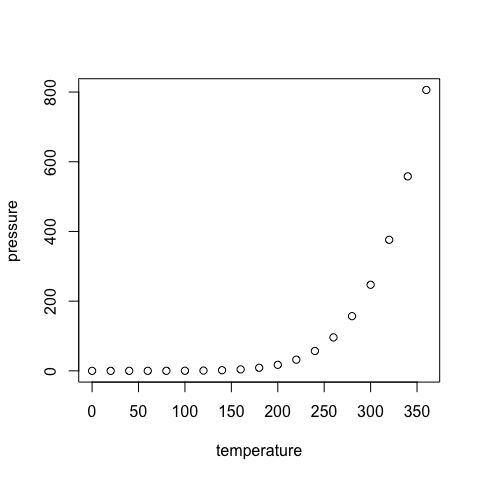

Test R Code on Github
================
Neil J. Gunther

-   [GitHub Documents](#github-documents)
-   [Including Code](#including-code)
-   [Including Plots](#including-plots)
-   [Including Math](#including-math)

GitHub Documents
----------------

This is an R Markdown format used for publishing markdown documents to GitHub. When you click the **Knit** button all R code chunks are run and a markdown file (.md) suitable for publishing to GitHub is generated.

Including Code
--------------

You can include R code in the document as follows:

``` r
summary(cars)
```

    ##      speed           dist       
    ##  Min.   : 4.0   Min.   :  2.00  
    ##  1st Qu.:12.0   1st Qu.: 26.00  
    ##  Median :15.0   Median : 36.00  
    ##  Mean   :15.4   Mean   : 42.98  
    ##  3rd Qu.:19.0   3rd Qu.: 56.00  
    ##  Max.   :25.0   Max.   :120.00

Including Plots
---------------

You can also embed plots, for example:



This plot was resized by using `fig.width=5`, and `fig.height=5` in the `knitr` R chunk. Note that the `echo = FALSE` parameter was added to the code chunk to prevent printing of the R code that generated the plot.

Including Math
--------------

RStudio `knitr` claims to be able to render certain simple inline equations, e.g., *E* = *m**c*<sup>2</sup>, as well as display equations like

*e*<sup>*i**π*</sup> + 1 = 0

and

$$
R = \\frac{N}{X} - Z
$$

using LaTex markup notation. However, although these equations are correctly rendered in the RStudio .rmd editor, they do not always render correctly either in the local HTML browser or on GitHub.
